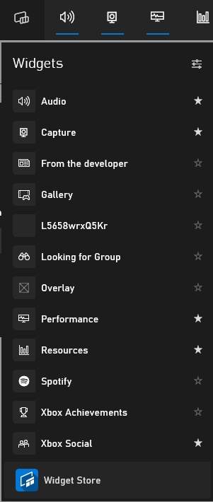

# Instructions
* Firstly you need to compile the solution.
* If you encounter any issues then go into your visual studio installer and install UWP app support.
* Copy the ```installer script.bat``` from the base project directory to ```Build\Debug``` OR  ```Build\Release```
* Run the script
* Once the script is installed click Win + G to open the GameBar
* Open the widget menu(Left Side Of Top Interaction Bar)
* Navigate down to the overlay app
* Open it
* If it doesn't full screen then close it and reopen it
<p align="left">
  
</p>
<br>
<p align="left">
  
</p>
