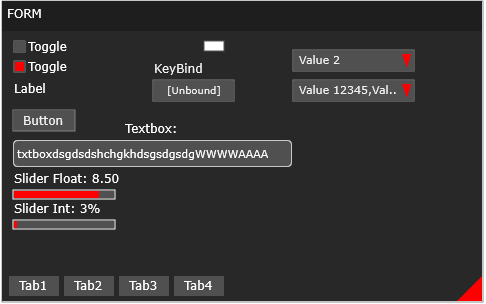

# GameBarGUI
GUI Overlay built on the Microsoft UWP GameBar.

## Images/Video:

## Features:
* Input Management
  * Character Input
  * Keyboard Press Up, Keyboard Press Down
  * Mouse Press Up, Mouse Press Down
  * Relative Window Mouse Position
* Drawing System
  * Circles
  * Rectangles
  * Gradient Rectangles
  * Triangles
  * Text
  * Clipped Text
  * Rounded Rectangle
  * Lines
* Font System
  * Create Fonts
  * Retrieve Fonts From Dictionary
  * Measure Text Width
  * Measure Text Height
* GUI Framework
  * Toggle
  * Slider(Templated)
    * Int
    * Float
    * Double
  * Button
  * TextBox
    * Select Text(Select Regions Of Text)
    * Copy Text (Copy A Region Of Text)
    * Paste Text (Paste At Point)
    * Delete Text (Delete Character Or Region Of Text)
  * Label
  * Tabs
  * List Box Tabs
    * Scroll Bar To Navigate Many Tabs
    * Text Culling / Revealing
  * Group Box
    * Scroll Bar to Navigate Many Elements
    * Dynamic Size To Fit Text
    * Text Culling 
  * Combo Box
    * Scroll Bar To Navigate
    * Dynamic Size To Fit Text
    * Text Culling
